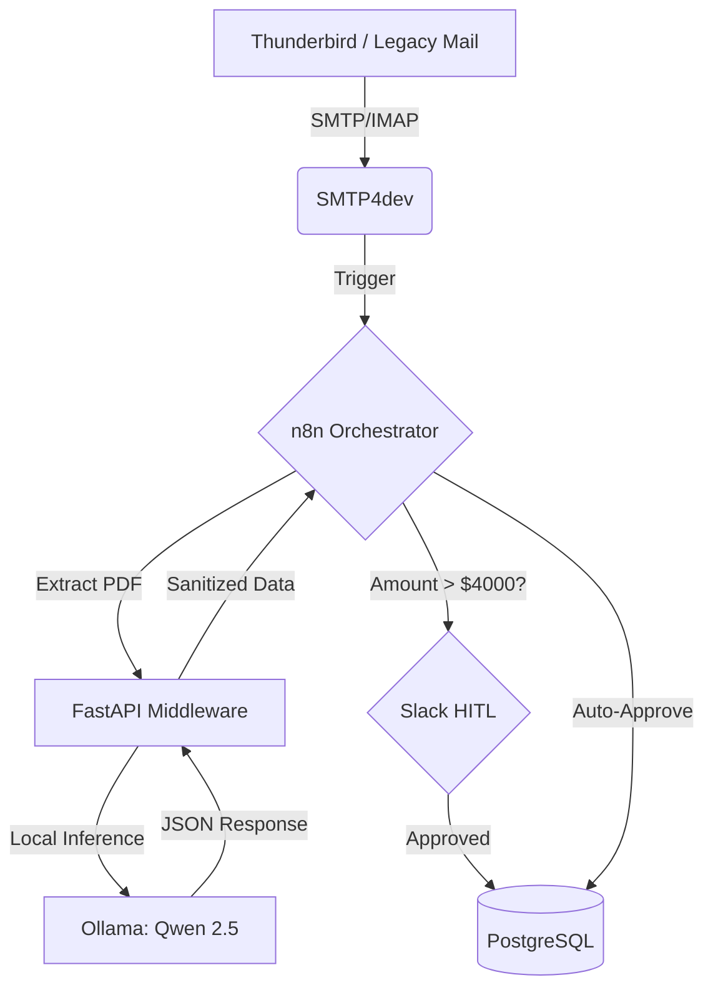

# 💳 Kitsu Fintech Engine: Autonomous Audit Pipeline

[](https://python.org)
[](https://fastapi.tiangolo.com)
[](https://n8n.io)
[](https://opensource.org/licenses/MIT)

## 🏗️ The Overview

**Kitsu Fintech Engine** is a high-performance middleware designed to bridge the gap between legacy communication protocols and modern AI-driven data orchestration.

In enterprise environments, financial data is often trapped in unstructured formats (PDFs, Emails). This engine acts as the **intelligent glue**, extracting, auditing, and persisting financial records with **100% data sovereignty** and human-in-the-loop validation.

---

## 🛠️ The Architecture (System Design)

The system operates as a distributed stack of microservices via **Docker Compose**:

1.  **Ingestion Layer:** Captures real-time traffic from legacy mail servers (IMAP/SMTP) via `smtp4dev`.
2.  **Orchestration Layer:** `n8n` acts as the event-driven router, handling binary extractions and state management.
3.  **Intelligence Layer (The Engine):** A **FastAPI** middleware that interfaces with a local `Ollama` instance running `Qwen 2.5 14B` to audit invoices with zero data egress.
4.  **Persistence Layer:** `PostgreSQL` with strict check constraints to ensure atomic data integrity.



## ⚡ Key Engineering Highlights

### 🔹 Protocol Bridging (Legacy-to-Modern)

Configured a simulated enterprise environment using **Thunderbird** and **smtp4dev** to test the pipeline's resilience against real-world mail protocols without external internet dependency. This ensures the system can be air-gapped for maximum security, a critical requirement for high-stakes financial data.

### 🔹 Async Middleware Logic

The Python backend implements **FastAPI** with asynchronous `httpx` clients. This architecture ensures the system remains non-blocking while waiting for high-parameter LLM (14B) inference tasks. This is crucial for optimizing the usage of local hardware, specifically managing the **NVIDIA RTX 3060 VRAM** efficiently during peak ingestion loads.

### 🔹 Deterministic Guardrails

LLMs can be unpredictable. This engine implements two layers of validation:

- **Response Sanitization:** A custom Python layer that strips Markdown artifacts and auto-corrects malformed JSON strings before they reach the orchestrator.
- **Pydantic Schema Validation:** Strict data typing for every financial record (Dates, ISO Currency codes, and float amounts) to prevent database corruption.

### 🔹 Human-in-the-Loop (HITL)

Designed a risk-aware threshold ($4,000). Transactions exceeding this limit are paused in `n8n` using **Slack API** interactive blocks. This hybrid approach ensures that while 90% of the work is automated, high-stakes financial decisions remain under strict human supervision with a full audit trail.

---

## 🚀 Technical Stack

- **Language:** Python 3.11 (FastAPI, Pydantic, HTTPX)
- **Inference:** Ollama (Qwen 2.5 14B / DeepSeek-R1)
- **Orchestration:** n8n (Self-hosted via Docker)
- **Database:** PostgreSQL 16 (With Check Constraints)
- **Dev Environments:** Docker Desktop, WSL2, smtp4dev, Mozilla Thunderbird

---

## 📂 Project Structure

```bash
├── api/
│   ├── main.py              # FastAPI Entry point & Async routes
│   ├── core/
│   │   ├── config.py        # Environment variables & API Keys
│   │   └── security.py      # X-API-KEY validation logic
│   ├── services/
│   │   ├── ollama_client.py # Async HTTPX wrapper for Kitsu Brain
│   │   └── sanitization.py  # Regex & Markdown stripping logic
│   └── requirements.txt     # Dependency management
├── docker-compose.yml       # Orchestration of the 5-service stack
├── n8n/
│   └── workflow.json        # Exported pipeline (The Glue Logic)
├── sql/
│   └── init.sql             # DB Schema with Check Constraints
└── .env.example             # Template for sensitive credentials
```

## 🛠️ Getting Started (The "Hands-on" Way)

1. **Prerequisites:** Ensure **Docker Desktop** (WSL2) and **Ollama** are running with the `qwen2.5-coder:14b` model pulled.
2. **Environment Setup:** Clone this repository and create your `.env` file based on `.env.example`.
3. **Launch Infrastructure:**
   ```bash
   docker-compose up -d
   ```
   _This will spin up the FastAPI Engine, PostgreSQL, n8n, and smtp4dev in a shared bridge network._
4. **Deploy Workflow:** - Open n8n (default `http://localhost:5678`).
   - Import `n8n/workflow.json`.
   - Ensure the HTTP Request nodes are pointing to the internal service name: `http://fintech-engine:8000/audit`.

---

## 🛡️ Future Roadmap

- [ ] **Vector Persistence:** Auto-syncing audited metadata into **Qdrant** for historical trend analysis and semantic search over invoices.
- [ ] **Multi-Model Fallback:** Implementing a circuit-breaker logic in Python to switch between Qwen 2.5 and DeepSeek-R1 if inference latency exceeds a 10s threshold.
- [ ] **Real-time Observability:** Exposing a **Streamlit** or **Grafana** dashboard to visualize audit throughput and LLM confidence scores in real-time.

---

<div align="center">
  <p><b>Mastered by Gabriel Molina</b></p>
  <p><i>Building Resilient, Sovereign, and Intelligent Architectures.</i></p>

[](https://linkedin.com/in/ivangabrielmolina)
[](https://github.com/IGabrielMolina)

</div>
